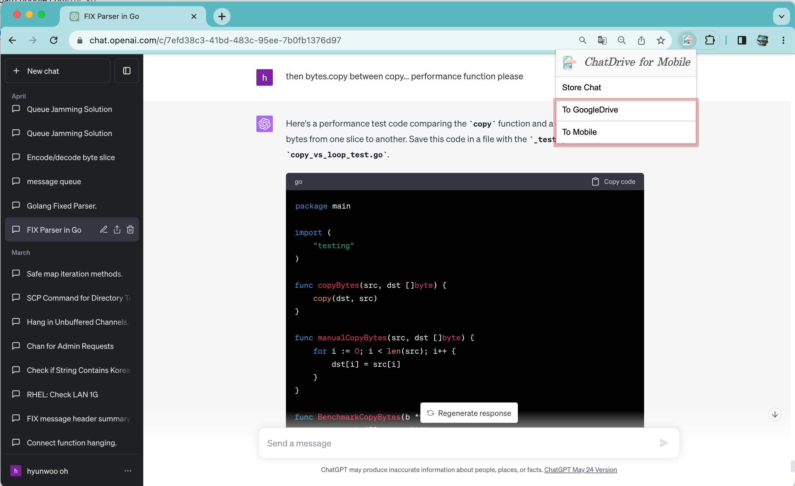
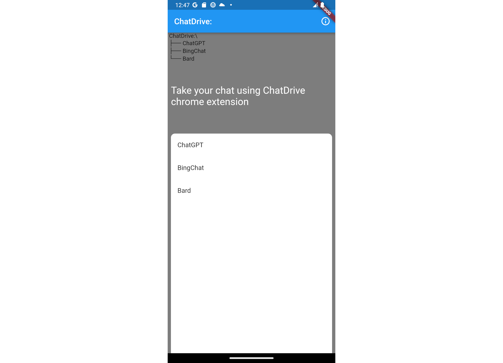
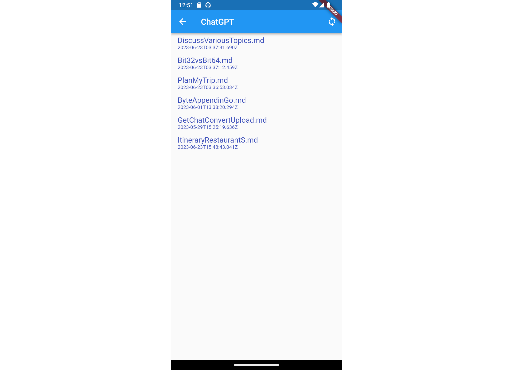
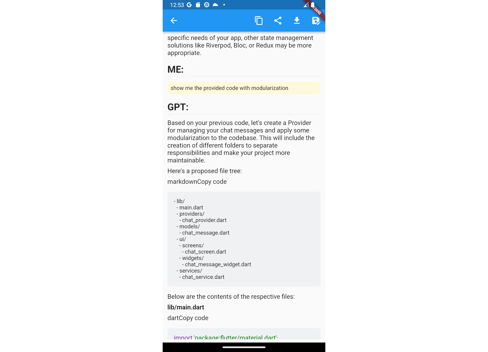

# ChatDrive Usage Guide

ChatDrive is an application that allows users to save and manage their AI chat conversations, which they've had using platforms like Bard, ChatGPT, etc. This tool has both a Chrome extension and an Android application.

## Step 1: Install Required Software
First, download and install the ChatDrive Chrome extension and Android application.

## Step 2: Interact and Save Conversations

After having a conversation with Bard, ChatGPT in your browser, click on 'To Google Drive' and 'To Mobile' buttons in the Chrome extension. Then, sign in to your Google account. This sign-in is used solely for storing the conversation in Google Drive.

## Step 3: Check Your Conversations in Google Drive

You can review your stored conversations in Google Drive.

## Step 4: Access Conversations via Application

The conversations are also accessible through the Android application. Click on the platform where you saved the conversations.

## Step 5: Sync Your Conversations

Press the Sync button located at the top right corner. This will fetch your saved conversation list from Google Drive. Choose a conversation you want to see.

Now, you can view your saved conversation.

## Step 7: Sample Conversation 

Here is an example that was also used in Bard.

# Note
ChatDrive currently only supports Chrome. Thus, for services like BingChat that only function in Bing, you would have to use a third-party tool that allows BingChat to operate in Chrome.
